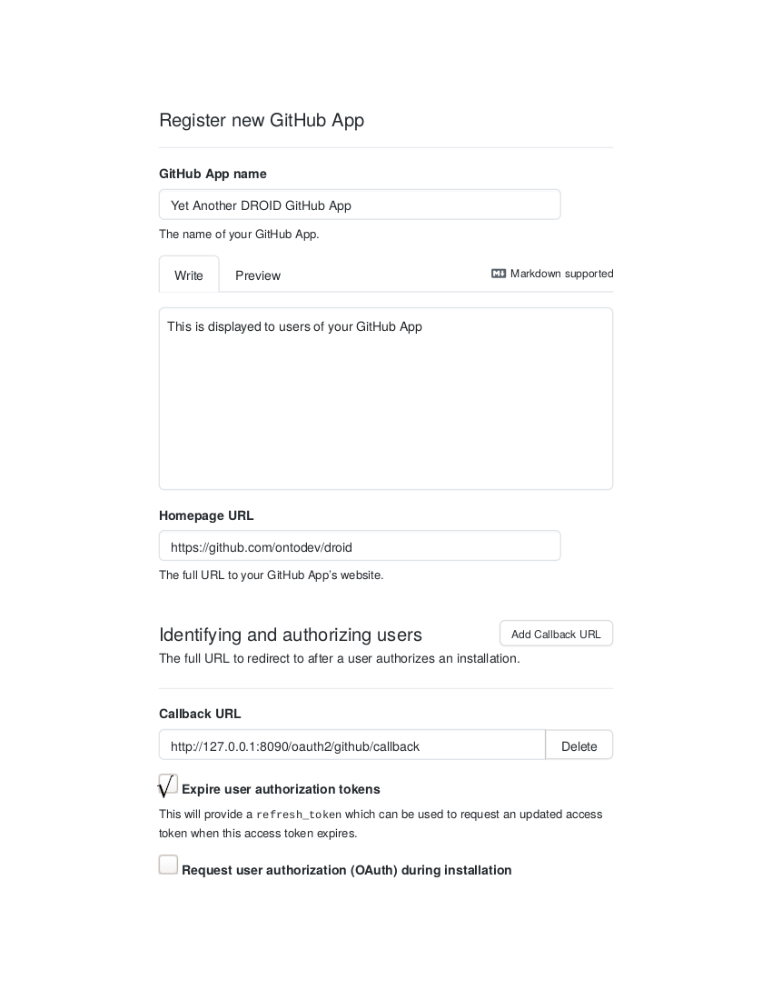
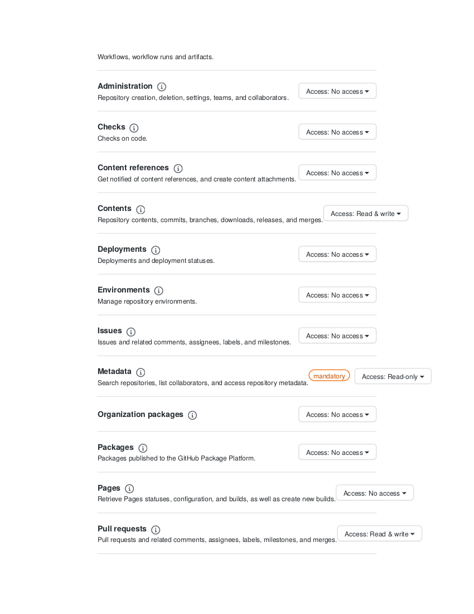

# DROID Reminds us that Ordinary Individuals can be Developers

DROID is a web-based interface for working with (1) a build system, managed by (2) a version control system. The current version of DROID is designed to work with (1) [GNU Make](https://www.gnu.org/software/make/manual/) and (2) [GitHub](https://docs.github.com/en). Our goal is to make these systems accessible to a wider community of project contributors, by exposing a curated set of functionality that is customized for each project.

DROID differs from Continuous Testing/Integration solutions such as Jenkins or Travis CI because DROID allows users to modify a working copy of a branch and run tasks on an ad-hoc basis before committing changes, optionally in a [Docker](https://www.docker.com/) container dedicated to the branch. DROID differs from Web/Cloud IDEs because users are limited to a specified set of files and tasks.

DROID can operate in either local or server mode. When DROID is configured to run in local mode, all GitHub authentication is performed on behalf of a single GitHub user account that is identified via that user's personal access token. When configured to run in server mode, DROID will allow multiple distinct GitHub users to be logged into the system simultaneously, using [GitHub App](https://docs.github.com/en/developers/apps) authentication to authenticate users.

DROID is designed to work on [UNIX](https://en.wikipedia.org/wiki/Unix) (Linux, macOS, FreeBSD, etc.) systems.

#### Table of contents

<!-- The following table of contents was auto-generated using mktoc (https://github.com/kevingimbel/mktoc).
     To regenerate the TOC, install mktoc and run: mktoc -m 2 -M 3 README.md -->
<!-- BEGIN mktoc -->
- [Installation and configuration](#installation-and-configuration)
  - [Prerequisites](#prerequisites)
  - [Installation](#installation)
  - [Configuration](#configuration)
  - [Validating your configuration](#validating-your-configuration)
  - [Configuring DROID for local mode using a personal access token](#configuring-droid-for-local-mode-using-a-personal-access-token)
  - [Configuring DROID for server mode](#configuring-droid-for-server-mode)
  - [Configuring DROID using the setup wizard non-interactively](#configuring-droid-using-the-setup-wizard-non-interactively)
  - [Dumping the current configuration](#dumping-the-current-configuration)
- [The `projects/` directory](#the-projects-directory)
- [Using branch-specific docker images](#using-branch-specific-docker-images)
- [GitHub Authentication](#github-authentication)
  - [Creating a personal access token](#creating-a-personal-access-token)
  - [Creating a new GitHub App](#creating-a-new-github-app)
  - [Generating a private key for your GitHub App](#generating-a-private-key-for-your-github-app)
  - [Installing your GitHub App on a project repository](#installing-your-github-app-on-a-project-repository)
- [Setting up DROID as a systemd service](#setting-up-droid-as-a-systemd-service)
- [Troubleshooting](#troubleshooting)
  - [Inspecting the log](#inspecting-the-log)
  - [Logging levels](#logging-levels)
<!-- END mktoc -->

## Installation and configuration

The following installation and configuration instructions have been written for [Debian GNU/Linux](https://www.debian.org/) (specifically, the [buster](https://www.debian.org/releases/buster/) release) but they should be reasonably straightforward to adapt to other flavours of UNIX (other Linux distributions, macOS, FreeBSD, etc.)

### Prerequisites

1. DROID requires the following packages to be installed:
   * `git` for command-line interaction with project repositories, locally and remotely via GitHub.
   * `leiningen` to generate the DROID executable.
   * `openjdk` or equivalent (>= Version 8)
   * `docker.io` for docker integration
   * `aha` for colourizing console output.

    On Debian Buster you can install these packages using `apt-get` in the following way:

    	$ sudo apt-get update && sudo apt-get -y install git leiningen openjdk-11-jdk docker.io aha

2. For `docker` to work properly, you must make sure to add the user who will be running DROID to the `docker` group:

        $ sudo usermod -aG docker $USER
        
    After adding yourself to the `docker` group, you must logout and then log back in for that change to take effect. Verify that the user is a member of the `docker` group by running the `groups` command. Make sure that the `docker` group appears in the list of groups to which the user belongs:

    	$ groups
    	group1 group2 ... docker
        
3. Running DROID in local mode requires the prior setup of a personal access token. Running DROID in server mode requires the creation and installation of a GitHub App. For more information see the section called [GitHub Authentication](#github-authentication) below. Once you have created your GitHub App and/or personal access token (or have received information concerning these from whoever did create them), continue with the section called [Installation](#installation) below.

### Installation

#### Create the DROID executable

1. Clone DROID's GitHub repository into a directory of your choice (e.g., `~/DROID`).

        $ git clone https://github.com/ontodev/droid.git ~/DROID

2. Change to the newly created directory:

        $ cd ~/DROID

3. Run the `install.sh` script:

        $ ./install.sh

    You will see warnings like:
    
        WARN - config.edn not found. Using example-config.edn. 
        2021-02-14 09:56:55.802-0500 - WARN :github-client-id must be set for non-local-mode
        2021-02-14 09:56:55.805-0500 - WARN :github-client-secret must be set for non-local-mode
        
    These can be safely ignored at this time. Section [Configuration](#configuration) contains instructions for configuring DROID.
    
    Assuming `install.sh` completes successfully, you should see the following (note that instead of `DROID_DIR` you will see the name of the directory that you cloned the DROID source code into in step 1 above).
    
        Generating DROID wrapper ...
        Done. DROID wrapper generated in DROID_DIR/droid.
        Make sure to include DROID_DIR in your environment variable PATH before running droid.
        
4. Now set your path variable as follows (replacing `DROID_DIR` with the directory you cloned DROID into in step 1):

        $ export PATH=$PATH:DROID_DIR

    You should add this line to your `.bashrc` or `.profile` file to make sure that DROID's path is included whenever you login.
    
    You can now run `droid --help` to see the command-line options available. Running `droid` without any options will start the server. Before doing so, please see the section called [Configuration](#configuration) below.

### Configuration

If you have not already gone through the section called [Installation](#installation), please go through that first.

DROID assumes that a file called `config.edn` exists in DROID's root directory. You can find an example in: [`example-config.edn`](example-config.edn). Before running DROID for the first time, you should create `config.edn`. (If this file does not exist, DROID will still run using the defaults contained in `example-config.edn`, but this is not very useful as that file contains no specific project configuration).

#### Manual configuration

DROID provides an optional setup wizard to guide you through setting up a `config.edn` file. This is discussed in the section called [Configuring DROID using the setup wizard](#configuring-droid-using-the-setup-wizard). If you are already familiar with DROID's configuration options, however, then you can use the following method instead. First, in DROID's main directory, copy the example configuration file to a file named `config.edn`:

    	$ cd DROID_DIR/
    	$ cp example-config.edn config.edn

Then edit the newly created `config.edn` file as necessary. The file includes extensive documentation which should make specific configuration changes easier.

#### Configuring DROID using the setup wizard

1. To initialize a new `config.edn` using DROID's optional setup wizard, run `droid` with the command-line switch: `--init-config` and answer the questions that follow. You can also use the setup wizard non-interactively (see the section called [Configuring DROID using the setup wizard non-interactively](#configuring-droid-using-the-setup-wizard-non-interactively) below). The following is an example of a typical (interactive) run of the setup wizard:

        $ droid --init-config
        WARNING - config.edn not found. Using example-config.edn. 
        2021-02-14 11:14:37.486-0500 - WARN :github-client-id must be set for non-local-mode
        2021-02-14 11:14:37.493-0500 - WARN :github-client-secret must be set for non-local-mode
        2021-02-14 11:14:37.905-0500 - INFO Checking root-level configuration ...
        2021-02-14 11:14:37.911-0500 - INFO Checking root-level docker configuration ...
        2021-02-14 11:14:37.912-0500 - INFO Checking configuration for project project1 ...
        2021-02-14 11:14:37.913-0500 - INFO Checking docker configuration for project project1 ...
        2021-02-14 11:14:37.917-0500 - INFO Checking configuration for project project2 ...
        2021-02-14 11:14:37.918-0500 - INFO Checking docker configuration for project project2 ...

    Since we haven't yet created our `config.edn` file, you can ignore the warnings above. Once these initial checks have completed, the setup wizard will ask if you would like to configure DROID to run in local mode (or in server mode). Pressing Enter implies the default answer of 'N', which means that DROID will be configured for server mode.

        DROID can run in local mode, in which case you will need to set the environment
        variable PERSONAL_ACCESS_TOKEN to the value of the GitHub personal access token
        (PAT) that will be used for authentication. A PAT is associated with a single
        user, who will own all GitHub actions performed by DROID. Alternately, DROID
        can run in server mode, in which case you will be asked to supply a GitHub App
        ID and PEM file to use for authentication to GitHub on behalf of the currently
        logged in user.
        Should DROID run in local mode?
        [Default: N]
        > N

    If you selected local mode then you can skip to step 4, otherwise continue on with the next step.

2. If you have chosen to configure DROID for server mode, the setup wizard will now ask you to provide a **GitHub App ID** and **PEM file**. These are needed by DROID to authenticate to GitHub on behalf of a logged in user. Someone may have already supplied you with this information. If so you can enter it now. Otherwise follow the steps in Sections [Creating a new GitHub App](#creating-a-new-github-app), [Generating a private key for your GitHub App](#generating-a-private-key-for-your-github-app), and [Installing your GitHub App on a project repository](#installing-your-github-app-on-a-project-repository).

        Enter the GitHub App ID to use for authentication.
        > 12345

        Enter the name of the .pem file (relative to /home/mike/DROID)
        to use for GitHub App authentication.
        > myfile.pem

3. If you have chosen to configure DROID for server mode, you will now be asked for a list of site-administrators. These GitHub users will have access to various general administration functions within DROID. (In local mode, DROID is set up for a single user only, who is implicitly considered to be a site administrator, so this option is inapplicable).

        Enter a comma-separated list of GitHub userids that DROID should consider to be
        site administrators.
        [Default: None]
        > lmcmicu,jamesaoverton,rctauber

4. Next we are asked for the port number that DROID will receive HTTP requests on. This must be specified for both local and server mode:

        Enter the port # that the server will listen on.
        [Default: 8090]
        > 8090

5. Next we are asked whether DROID should use the HTTP (insecure) or HTTPS (secure) protocol:

        Use HTTPS? (y/n)
        [Default: Y]
        > 

6. Next, we can configure individual projects. Begin by supplying the GitHub coordinates, i.e., the part that comes after `github.com` in the URL of the GitHub repository for the project.

        Configure a new project? (y/n)
        [Default: N]
        > y

        Enter the github coordinates for the new project. The is the part of the URL
        for the project repository that comes after github.com/,e.g.,
        https://github.com/GITHUB_COORDINATES, where GITHUB_COORDINATES is of the
        form: '<org or owner>/<repository name>' and contains no spaces or special
        characters other than '/', '_','-'.
        > lmcmicu/my-project

    This initiates a configuration block with (in the example above) the keyword `lmcmicu-my-project` ('/' replaced by '-') that will be included in `config.edn`.

7. The next set of questions relate to the use of Docker in the specified project. DROID can be configured to run processes in [Docker](https://www.docker.com/) containers, where each container is dedicated to running processes in a particular Git branch of the project. If you want to enable docker for the project currently being configured, answer `Y` and select the desired [docker image](https://hub.docker.com/) to use when creating the project's containers, otherwise answer `N`. Note that in addition to configuring a default image for the project, it is also possible for individual branches in a project to use their own customized docker image. See the section below entitled [Using branch-specific docker images](#using-branch-specific-docker-images).

        Do you want to enable docker for: lmcmicu-my-project? (y/n)
        [Default: N]
        > y

        Enter the docker image to use when creating containers for project: lmcmicu-my-project
        [Default: debian:buster]
        > obolibrary/odkfull

8. If you want to configure another project, answer `Y` to the next question and repeat steps 6&ndash;7, otherwise answer `N`.

        Configure a new project? (y/n)
        [Default: N]
        > n
        New configuration written to config.edn. You should now edit this file in your 
        favorite editor to further specify configuration parameters like project 
        titles, custom makefile paths, etc.

You now have the minimal configuration required to work with whatever projects you happen to have configured in steps 6&ndash;7. You will probably want to manually edit `config.edn` for further tweaks, however. At a minimum you will likely want to change `:project-title` and `:project-description` for the projects you configured in steps 6&ndash;7. The generated `config.edn` file includes documentation for all of the available configuration parameters, including these ones.

### Validating your configuration

Whenever you make manual changes to `config.edn`, you should then run `droid` with the `--check-config` option:

        $ droid --check-config
        2021-02-16 11:07:03.424-0500 - WARN :github-client-id must be set for non-local-mode
        2021-02-16 11:07:03.427-0500 - WARN :github-client-secret must be set for non-local-mode
        2021-02-16 11:07:03.876-0500 - INFO Checking root-level configuration ...
        2021-02-16 11:07:03.879-0500 - INFO Checking root-level docker configuration ...
        2021-02-16 11:07:03.879-0500 - INFO Checking configuration for project lmcmicu-my-project ...
        2021-02-16 11:07:03.880-0500 - INFO Checking docker configuration for project lmcmicu-my-project ...
        Environment error: Local mode disabled but environment variable GITHUB_CLIENT_ID not set.
        Environment error: Local mode disabled but environment variable GITHUB_CLIENT_SECRET not set.
        Environment error: PEM file: myfile.pem does not exist

In this case we see that DROID is complaining that the environment variables `GITHUB_CLIENT_ID` and `GITHUB_CLIENT_SECRET` are not defined, and that the given PEM file does not exist. These are all necessary to run DROID in server mode but you need to explicitly set them to enable DROID to read them. If, on the other hand, we had configured DROID for local mode, but did not set the environment variable, `PERSONALL_ACCESS_TOKEN`, we would have received an error relating to it instead. The `--check-config` validation considers all of these to be **Environment errors** (a file is not an environment variable, but it is still part of DROID's operating environment). Such errors indicate that the configuration specified in `config.edn` was successfully validated, but that elements of the environment that are additionally required for DROID's operation are not present. To configure these environment elements for server mode and local mode, respectively, see the sections [Configuring DROID for server mode](#configuring-droid-for-server-mode) and [Configuring DROID for local mode](#configuring-droid-for-local-mode-using-a-personal-access-token).
    
Running `droid --check-config` may also result in **Configuration errors**, which are errors in `config.edn` itself. For example, open `config.edn` in your favourite editor and change the following line:

    :push-with-installation-token false

to:

    :push-with-installation-token "false"

If we now validate the config file we will see the following configuration error:

    $ droid --check-config
    2021-02-16 11:18:52.548-0500 - INFO Checking root-level configuration ...
    Configuration error: Configuration parameter :push-with-installation-token has invalid type: class java.lang.String (valid types are: [java.lang.Boolean] )

This error indicates that the configuration parameter `:push-with-installation-token` has been supplied a value of the wrong type. In this case we need to remove the quotation marks around `false`.
    
In some cases DROID may not even be able to read the configuration file as a result of a syntax error. In this case you will see an error like:
    
    ERROR reading config.edn: <error message>

### Configuring DROID for local mode using a personal access token

When DROID is configured to run in local mode, all GitHub authentication will be performed on behalf of a single github user account that is identified via that user's personal access token. For instructions on how to create a personal access token for your GitHub account, see the section called [Creating a personal access token](#creating-a-personal-access-token).

Once you have created a personal access token, you will need to set the environment variable `PERSONAL_ACCESS_TOKEN` with the value of your newly created token whenever running DROID. The easiest way to do this is to place a line like the following in your `~/.bashrc` file (or in some other "secrets" file that is read either at login or right before running DROID):

    $ export PERSONAL_ACCESS_TOKEN=your_token

Remember that after editing `~/.bashrc` you should either logout and login again or run

    $ source ~/.bashrc

to load the new environment variable.

If you would like to configure DROID to start automatically when your computer boots, see the section [Setting up DROID as a systemd service](#setting-up-droid-as-a-systemd-service) below.

### Configuring DROID for server mode

When configured to run in server mode, DROID will allow multiple distinct GitHub users to be logged into the system simultaneously. Note that DROID only allows one process to run per project branch at any one time.

In server mode, DROID uses [GitHub Apps](https://docs.github.com/en/developers/apps) to authenticate on behalf of a logged in github user (for more information, see [this page](https://docs.github.com/en/free-pro-team@latest/developers/apps/identifying-and-authorizing-users-for-github-apps)).

For this to work properly, DROID assumes that:

1. A **private key file** exists and has been saved somewhere accessible to DROID. Its location must be indicated in `config.edn` using the parameter `:pem-file` (see Section [Configuration](#configuration)).

2. The following environment variables have been set:
   * `GITHUB_CLIENT_ID`
   * `GITHUB_CLIENT_SECRET`
   * `GITHUB_APP_STATE`

where:
* `GITHUB_APP_STATE` can be set to any random string.
* `GITHUB_CLIENT_ID`, `GITHUB_CLIENT_SECRET`, and the private key file are all associated with a particular GitHub App. If you have not already created a GitHub App and generated your private key file (and no one else has done this for you), see the sections: [Creating a new GitHub App](#creating-a-new-github-app), [Generating a private key for your GitHub App](#generating-a-private-key-for-your-github-app), and [Installing your GitHub App on a project repository](#installing-your-github-app-on-a-project-repository).

Now that you know your GitHub client ID and secret, have generated your private key file, and indicated its location in `config.edn` (either by using the setup wizard or manually), you will need to set the environment variables: `GITHUB_CLIENT_ID`, `GITHUB_CLIENT_SECRET`, and `GITUB_APP_STATE` before running DROID. The easiest way to do this is to place lines like the following in your `~/.bashrc` file (or in some other "secrets" file that is read either at login or right before running DROID):

    $ export GITHUB_CLIENT_ID=your_github_client_id
    $ export GITHUB_CLIENT_SECRET=your_github_client_secret
    $ export GITHUB_APP_STATE=random_string

Remember that after editing `~/.bashrc` you should either logout and login again or run

    $ source ~/.bashrc

to load the new environment variables.

If you would like to configure DROID to start automatically when your computer boots, see the section [Setting up DROID as a systemd service](#setting-up-droid-as-a-systemd-service) below.

### Configuring DROID using the setup wizard non-interactively

When running DROID with the `--init-config` option, some or all of the following command-line arguments may optionally be supplied as well: `--port`, `--site-admins`, `--local-mode`, `--github-app-id`, `--pem-file`, `--project-github-coords`, `--enable-project-docker`, and `--project-docker-image`.

In the case where some parameter, `param2`, is inapplicable given the presence of some other parameter, `param1`, DROID ignores the value of `param2`. For instance, in the following example, the value of `--project-docker-image` will be ignored because `--enable-project-docker` has been set to false:

    $ droid --init-config --enable-project-docker=false --project-docker-image=myimage

If one or more of the available further options to `--init-config` has not been specified, and it is not inapplicable given the other specified options, DROID will interactively ask the user to supply the value of that parameter. In the following example, for instance, because `--port` and `--local-mode` have been specified on the command-line, these questions do not need to be asked, but DROID will still give the user the opportunity to define one or more project configuration(s):

    $ droid --init-config --port=8090 --local-mode=true
    WARNING - config.edn not found. Using example-config.edn. 
    2021-02-19 10:57:29.927-0500 - INFO Checking root-level configuration ...
    2021-02-19 10:57:29.929-0500 - INFO Checking root-level docker configuration ...
    2021-02-19 10:57:29.930-0500 - INFO Checking configuration for project project1 ...
    2021-02-19 10:57:29.930-0500 - INFO Checking docker configuration for project project1 ...
    2021-02-19 10:57:29.931-0500 - INFO Checking configuration for project project2 ...
    2021-02-19 10:57:29.932-0500 - INFO Checking docker configuration for project project2 ...

    Configure a new project? (y/n)
    [Default: N]
    > y

    Enter the github coordinates for the new project. The is the part of the URL
    for the project repository that comes after github.com/,e.g.,
    https://github.com/GITHUB_COORDINATES, where GITHUB_COORDINATES is of the
    form: '<org or owner>/<repository name>' and contains no spaces or special
    characters other than '/', '_','-'.
    > myorg/myrepo

    Do you want to enable docker for: myorg-myrepo? (y/n)
    [Default: N]
    > 

    Configure a new project? (y/n)
    [Default: N]
    > 
    New configuration written to config.edn. You should now edit this file in your 
    favorite editor to further specify configuration parameters like project 
    titles, custom makefile paths, etc.

Note that, **only one** project configuration may be specified non-interactively (as opposed to indefinitely many when running `--init-config` interactively):

    $ droid --init-config --port=8090 --local-mode=true --project-github-coords=myorg/myrepo --enable-project-docker=false
    WARNING - config.edn not found. Using example-config.edn. 
    2021-02-19 11:03:57.363-0500 - INFO Checking root-level configuration ...
    2021-02-19 11:03:57.372-0500 - INFO Checking root-level docker configuration ...
    2021-02-19 11:03:57.373-0500 - INFO Checking configuration for project project1 ...
    2021-02-19 11:03:57.378-0500 - INFO Checking docker configuration for project project1 ...
    2021-02-19 11:03:57.378-0500 - INFO Checking configuration for project project2 ...
    2021-02-19 11:03:57.379-0500 - INFO Checking docker configuration for project project2 ...
    New configuration written to config.edn. You should now edit this file in your 
    favorite editor to further specify configuration parameters like project 
    titles, custom makefile paths, etc.

### Dumping the current configuration

To dump the currently configured parameters to STDOUT, call the server executable using the command-line switch: `--dump-config`. If you want to save the dumped configuration to a file, redirect the output as in the following example:

    	$ droid --dump-config > config-2021-02-16.edn

## The `projects/` directory

DROID assumes that there exists a directory called `projects/` within its root directory. Within `projects/` there should be a subdirectory corresponding to each project defined in `config.edn` (see above). Within each individual project directory there should be a `workspace/` directory. Within each project's `workspace/` directory there should be a subdirectory corresponding to each branch managed by the project. Finally, each branch directory should contain, at a minimum, a `Makefile`. Optionally a branch can also include a `Dockerfile` (see [Using branch-specific docker images](#using-branch-specific-docker-images)). For example:

```
projects/
├── project1/
│   └── workspace/
│       ├── branch1/
│       │   └── Makefile
│       │   └── Dockerfile (optional)
│       │   └── ...
│       └── branch2/
│           └── Makefile
│           └── Dockerfile (optional)
│           └── ...
└── project2/
    └── workspace/
        ├── branch1/
        │   └── Makefile
        |   └── Dockerfile (optional)
        │   └── ...
        └── branch2/
            └── Makefile
            └── Dockerfile (optional)
            └── ...
```

The `project1/`, `project2/`, etc. directories (and their subdirectories) should be writable by `DROID`.

## Using branch-specific docker images

By default, branch containers for a particular project are created using the image selected by the user for the project during the configuration stage. This project-default image can be overridden (or customised) by adding a file called `Dockerfile` to the root directory. For Dockerfile syntax, see https://docs.docker.com/engine/reference/builder/#format.

## GitHub Authentication

### Creating a personal access token

To create a personal access token in GitHub, follow the step-by-step instructions on [this page](https://docs.github.com/en/github/authenticating-to-github/creating-a-personal-access-token). Note, when creating your personal access token, that DROID requires at a minimum, **public_repo** permission.

<table border="1" style="margin-left: auto; margin-right: auto;">
<tr>
    <td>
    
    </td>
</tr>
</table>

### Creating a new GitHub App

To create your own GitHub App to use with DROID, follow the step-by-step instructions on [this page](https://docs.github.com/en/developers/apps/creating-a-github-app), noting the following (see also the screenshots below this list):    

* The **Homepage URL** should be set to `https://github.com/ontodev/droid`
* The **Callback URL** should be set to `<protocol>://<server-address:server-port>/oauth2/github/callback` where `<protocol>` is either `http` or `https`.
* **Expire user authorization tokens** should be selected.
* **Webhooks** should be disabled.
* Make sure that the DROID App has, at a minimum, the **following permissions:**
  - Contents: read & write
  - Metadata: read only
  - Pull requests: read & write
* You can allow the GitHub App to be installed only on your own account (i.e., allow it to access only repositories that are owned by you), or you can allow it to be installed on any account. **If you want to use DROID to work on project repositories that are owned by other users and/or organisations, you need to allow the GitHub App to be installed on any account**.

<table border="1" style="margin-left: auto; margin-right: auto;">
    <tr>
        <td>
        
        </td>
        <td>
        
        </td>
    </tr>
    <tr>
        <td>
        
        </td>
        <td>
        
        </td>
    </tr>
    <tr>
        <td>
        
        </td>
        <td>
        
        </td>
    </tr>
</table>

### Generating a private key for your GitHub App

1. After creating your GitHub App, take note of the **App ID** and **Client ID**. The **Client ID** will  be used to define the value of the environment variable `GITHUB_CLIENT_ID` (see [Configuration](#configuration)). The value of **App ID** should be placed inside `config.edn` as the parameter `:github-app-id`. This can be done either manually or using the setup wizard (see [Configuration](#configuration)).

<table border="1" style="margin-left: auto; margin-right: auto;">
<tr>
    <td>
    
    </td>
</tr>
</table>

2. Click on the button **Generate a new client secret** and take note of the generated string. You will need to set the environment variable `GITHUB_CLIENT_SECRET` with this value (see [Configuration](#configuration)).

<table border="1" style="margin-left: auto; margin-right: auto;">
<tr>
    <td>
    
    </td>
</tr>
</table>

3. Click on the button: **Generate a private key**

<table border="1" style="margin-left: auto; margin-right: auto;">
<tr>
    <td>
    
    </td>
</tr>
</table>

4. Save the file in DROID's main directory (the directory you cloned DROID into earlier (see the section called [Create the DROID executable](#create-the-droid-executable) above)).

<table border="1" style="margin-left: auto; margin-right: auto;">
<tr>
    <td>
    
    </td>
</tr>
</table>

The name of the newly generated `.pem` file should now be added to `config.edn` as the parameter `:pem-file`. This can be done either manually or using the setup wizard (see [Configuration](#configuration)).

### Installing your GitHub App on a project repository

1. To use your new GitHub App with various project repositories, you need to "install" the App on those repositories. Click on the **Install App** tab.

<table border="1" style="margin-left: auto; margin-right: auto;">
<tr>
    <td>
    
    </td>
</tr>
</table>

2. Choose the account that owns the repository/repositories that you want to install your GitHub App on.

<table border="1" style="margin-left: auto; margin-right: auto;">
<tr>
    <td>
    
    </td>
</tr>
</table>

3. Install your App to specific repositories owned by the selected account, or to all current and future repositories owned by the account, and then click on **Install & Request**. (Note: If you are the owner of the account that the GitHub App will be installed to, the button will just read **Install**.) The owner of the account will have to approve your installation request before you can use your new GitHub App on the selected repositories.

<table border="1" style="margin-left: auto; margin-right: auto;">
<tr>
    <td>
    
    </td>
</tr>
</table>

## Setting up DROID as a systemd service

1. Edit the file [`droid.service`](droid.service) located in DROID's main directrory and make the following edits:

    a. Replace `UNIX_USER` with the username of the system user that will be used to run DROID.

    b. Replace `DROID_DIR` with the directory you cloned DROID into earlier (see the section called [Create the DROID executable](#create-the-droid-executable) above).

    c. If DROID has been configured to run in local mode, replace the line:

        	Environment="PERSONAL_ACCESS_TOKEN="

    		with:

        	Environment="PERSONAL_ACCESS_TOKEN=YOUR_TOKEN"

    where `YOUR_TOKEN` is the actual value of your personal access token. To create a personal access token, see the section called [Creating a personal access token](#creating-a-personal-access-token).

    d. If DROID has been configured to run in server mode, replace the lines:

			Environment="GITHUB_APP_STATE="
			Environment="GITHUB_CLIENT_ID="
			Environment="GITHUB_CLIENT_SECRET="
            
            with:

			Environment="GITHUB_APP_STATE=RANDOM_STRING"
			Environment="GITHUB_CLIENT_ID=YOUR_CLIENT_ID"
			Environment="GITHUB_CLIENT_SECRET=YOUR_CLIENT_SECRET"

    where `RANDOM_STRING` can be any random string, and `YOUR_CLIENT_ID` and `YOUR_CLIENT_SECRET` are associated with the GitHub App that you will be using for authentication. For instructions on how to create a GitHub App, see the sections above called: [Creating a new GitHub App](#creating-a-new-github-app) and [Generating a private key for your GitHub App](#generating-a-private-key-for-your-github-app).


2. As root, copy the file [`droid.service`](droid.service) to the `/etc/systemd/system/` directory:

        $ sudo cp droid.service /etc/systemd/system/

3. Start the service:

        $ sudo systemctl start droid

4. Verify that the DROID service has started correctly:

		$ systemctl status droid
		● droid.service - DROID Reminds us that Ordinary Individuals can be Developers
		   Loaded: loaded (/etc/systemd/system/droid.service; disabled; vendor preset: enabled)
		   Active: active (running) since Sun 2021-02-21 12:43:44 EST; 2min 23s ago
		 Main PID: 1336 (java)
		    Tasks: 13 (limit: 1149)
		   Memory: 155.8M
		   CGroup: /system.slice/droid.service
           └─1336 java -jar /home/mike/DROID/target/uberjar/droid-0.1.0-SNAPSHOT-standalone.jar
           
    If DROID has started successfully it should say **active (running)**.

4. Enable the service so that it will start automatically when your system boots:

        $ sudo systemctl enable droid

5. DROID's log can be configured to be written to a particular file using the parameter `:log-file` in `config.edn`. If this is not set, DROID will output log statements to STDERR. In the latter case, you may monitor them using the `journalctl` command as follows:

        $ sudo journalctl -f -u droid.service

## Troubleshooting

### Inspecting the log

It is often possible to identify and resolve issues by inspecting DROID's log file. The location of the file can be configured using the parameter `:log-file` in `config.edn`. If `:log-file` is not set (or set to `nil`), then the log will be written to STDERR. If DROID has been set up to run as a service, the log can be viewed using the command:

        $ sudo journalctl -f -u droid.service

Otherwise if `:log-file` is set to a particular file, then the log can be opened in your favourite text editor and inspected, or it can be followed using `tail`:

        $ tail -f LOG_FILE

### Logging levels

By default, DROID is set to log only information, warning, and error messages. Sometimes, however, it can be useful for troubleshooting certain errors to enable more verbose logging. This behaviour can be controlled using DROID's configuration file `config.edn`. To do so, edit the file and set the parameter `:log-level` to `:debug`.

DROID can also be configured to be even _less_ verbose by setting the logging level to `:warn`, `:error`, or `:critical`, though this is not recommended. For normal operation it is recommended to set the logging level to `:info`, and to use the `:debug` setting for troubleshooting as the need arises.

**Note that after making changes to `config.edn`, the DROID server must be restarted.** If you have set up DROID as a `systemd` service, it can be reatarted by running:

        $ sudo systemctl restart droid
